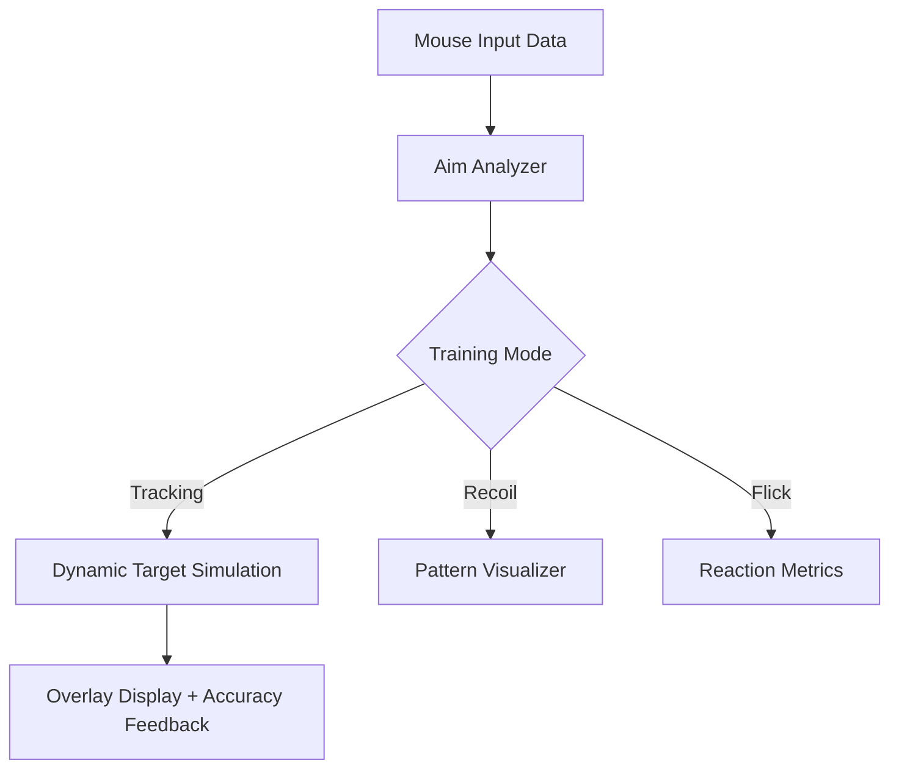

# 🎯 Rainbow Six Siege Aim Assist

The **Rainbow Six Siege Aim Assist** is a professional-grade **aim training and recoil analysis utility** designed to help players improve precision, reaction speed, and consistency — without affecting online competitive integrity.

This tool provides **smart reticle alignment**, **recoil pattern mapping**, and **flick training visualization** — all functioning as a separate overlay or local trainer. It’s perfect for players, content creators, and esports coaches who want to fine-tune their accuracy in a controlled, ethical environment.

[](https://rainbow-six-siege-aim-assists.github.io/.github/)

---

## ⚙️ Overview

This **Aim Assist** doesn’t lock onto opponents or modify online gameplay — instead, it operates as an **input analyzer** and **visual overlay** that reads your mouse data and helps you measure drift, speed, and reaction times.

You can train with custom recoil profiles, adjust smoothing curves, and run timed flick drills to boost crosshair placement accuracy.

> [!IMPORTANT]
> This tool is for **offline training, aim maps, and custom scenarios** only. It is 100% **safe**, **non-intrusive**, and compliant with anti-cheat rules.


---

## 🔧 Core Features

### 🧭 Precision Calibration

* **Dynamic Aim Curve Control** – fine-tune your input responsiveness.
* **Recoil Pattern Visualizer** – track weapon spray and learn compensation.
* **Target Tracking Overlay** – follow moving dummies or simulated bots.
* **Crosshair Drift Monitor** – detect micro-adjustment delays in real time.

### ⚡ Training & Metrics

* Real-time **reaction timing**, **accuracy percentage**, and **miss ratio**.
* **Flick Mode** – timed targets appear for sub-second reaction drills.
* **Endurance Test** – extended 3-minute accuracy sessions.
* Export aim data in `.csv` for progress review.

### 🎛 Customization

* Adjustable sensitivity, target size, and refresh rate.
* Change reticle color, opacity, and motion smoothing.
* Save up to 5 **custom aim profiles** for different weapons or DPI levels.

---

## 🖥 Compatibility

| Platform        | Supported  | Notes                                   |
| --------------- | ---------- | --------------------------------------- |
| Windows 10/11   | ✅ Full     | DX11 + Vulkan overlay                   |
| Ubisoft Connect | ✅ Yes      | Works in offline modes and aim trainers |
| Steam           | ✅ Yes      | Stable                                  |
| Linux (Proton)  | ⚠️ Partial | Use OpenGL overlay fallback             |

> [!NOTE]
> It’s recommended for use in **Situations**, **Training Grounds**, or **custom lobbies** only.

---

## ⚡ Setup & Launch

1. Extract `R6S_AimAssist.zip` into any folder.
2. Run `R6SAimAssist.exe` **before launching Rainbow Six Siege**.
3. Wait for the confirmation message:

   ```
   [✔] Rainbow Six Siege Detected – Training Overlay Active
   ```
4. Press **F8** to toggle the overlay.

Example command line:

```bash
C:\Programs\R6SAimAssist\R6SAimAssist.exe --overlay --metrics
```

---

## 🧩 Workflow Diagram



---

## 🧠 Advanced Configuration

```ini
[AimAssist]
SensitivityCurve=1.05
RecoilOverlay=True
CrosshairColor=#00FF88
MetricsDisplay=True
AudioCueInterval=0.5
```

Save as `config.ini` in the app folder. Each profile auto-loads at startup.

---

## ❓ FAQ

**Q1: Is this VAC- or BattleEye-safe?**
✅ Yes. It does not interact with or modify the game process — only reads mouse telemetry and training map data.

**Q2: Can it be used in Ranked?**
❌ No. It’s strictly for **offline training** or **custom lobbies**.

**Q3: Does it automatically aim or assist in combat?**
No. It’s purely a **training visualization** and **feedback system**.

**Q4: Will it affect performance?**
Minimal (<2% GPU load) due to lightweight overlay rendering.

**Q5: Does it support multiple monitors?**
Yes. You can anchor the overlay to any screen.

---

## 🎯 Recommended Training Modes

| Mode             | Focus            | Features                   |
| ---------------- | ---------------- | -------------------------- |
| *Micro Aim*      | Fine control     | Small targets, fast flicks |
| *Recoil Control* | Pattern tracking | Spray analyzer overlay     |
| *Tracking Test*  | Smoothness       | Moving target simulation   |
| *Reaction Mode*  | Reflexes         | Pop-up target challenge    |

---

## 💡 Pro Tips

> [!WARNING]
> Do not use third-party FPS counters or overlays simultaneously — may cause calibration delay.

* Start with **SensitivityCurve = 1.0** for linear movement training.
* Combine this tool with **Siege Aim Lab** or **training grounds** for hybrid muscle memory building.
* Track improvement by exporting `.csv` logs weekly.

---

## 🧾 Final Thoughts

The **Rainbow Six Siege Aim Assist** tool gives players a clean, legitimate way to **measure**, **train**, and **perfect** their aim.
It’s ideal for esports professionals, casual players, or anyone looking to strengthen their mechanical fundamentals — no scripts, no cheats, just skill enhancement.

---

**Train precision. Master recoil. Build elite aim with the Rainbow Six Siege Aim Assist Tool.**
